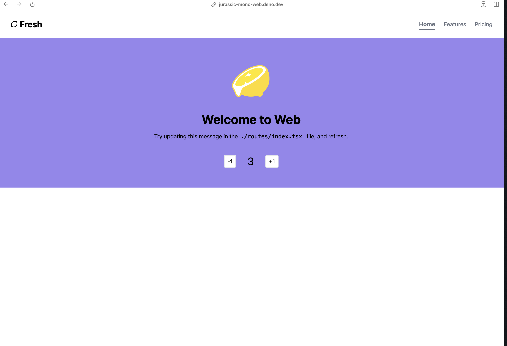

# Denomono 🦕

Denomono is the code you get when you run
```bash
deno run -A jsr:@jurassicjs/create-monodeno
```

## What's the purpose of Denomono?
I like Deno. I like monorepos. I like to have a monorepo with Deno. So I created Denomono.

### Are there better solutions out there?
Probably, but I couldn't find it. If you know of something, please create an issue and let me know. I'd love to see what you've got.

## What's inside Denomono?
Out of the box, Denomono comes with the following features:

- [x] Monorepo with Deno and two fresh.js projects
- [x] A way to run all the projects at once (see: how to run locally)
- [x] An example deploy.yml that deploys the monorepo apps to deno.deploy
- [x] TailwindCSS set up for the mono repo
- [x] A UI library for the mono repo so you can share components between the two projects


## How to run locally
run
```bash
deno task mono start
```

In fact, any task you run with mono will run the task in all the projects. So you can run.

For example, let's build the projects
```bash
deno task mono build
```

Demo Sites:

https://jurassic-mono-web.deno.dev/


https://jurassic-mono-docs.deno.dev/


Enjoy Denomono! Happy coding! 🦕
